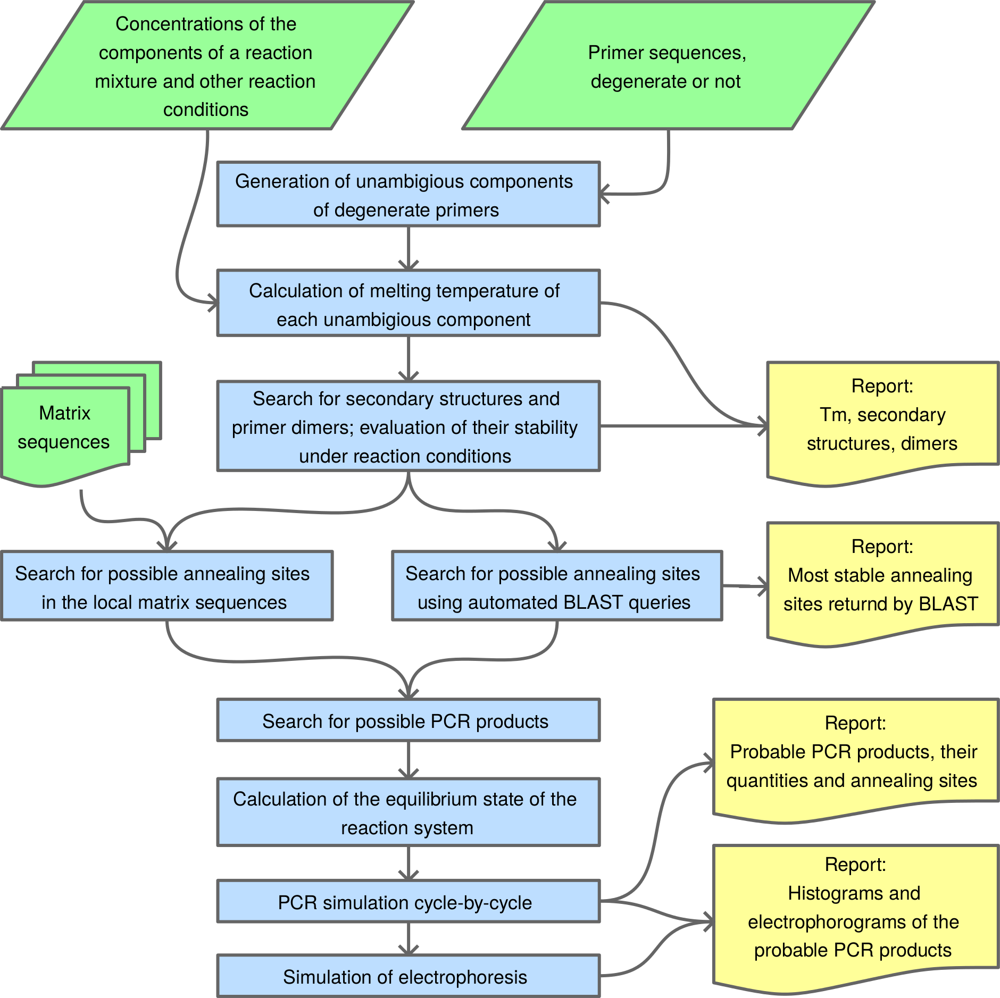

# DegenPrimer

## Introduction

DegenPrimer is a tool to check the quality of degenerate primers. It calculates melting temperatures, finds stable dimers, hairpins and crossdimers, uses BLAST search and full-fledged PCR simulation cycle by cycle to provide accurate predictions of possible PCR products and their quantities.

All calculations of thermodynamic parameters are made using Nearest Neighbor model and thermodynamic tables with corrections for particular PCR conditions. PCR simulation supports multiplex PCR with arbitrary number of primers.

The program has simple command line interface as well as a [separate GUI](https://github.com/allista/DegenPrimerGUI).
PBS is also supported with [PBS-utils](https://github.com/allista/PBS-utils).

## Installation

DegenPrimer was developed with **Python-2.7** which is still required to run the program. A set of older versions of several third party libraries (like numpy, scipy, etc.) is also required. All the dependencies are listed in `requirements*.txt` files.

It also uses the [BioUtils](https://github.com/allista/BioUtils) library, linked as a git submodule.

To install and run the program it is recommended to use virtual environment:

```bash
# clone this repository WITH SUBMODULES
git clone  --recurse-submodules https://github.com/allista/DegenPrimer.git
cd DegenPrimer

# create and activate virtual environment
python2 -m venv venv
source venv/bin/activate

# install all the dependencies into virtual environment
pip install -r requirements.txt

# install the program itself
pip install -v .

# now to run the program
degen_primer --some --options path/to/job_configuration.cfg
```

### Docker Image

DegenPrimer is also available as a [docker image](https://hub.docker.com/repository/docker/allista/degen-primer/general).

To run it:

- make two folders, one for input files (e.g., `./my_input`) and another for the output (e.g., `./my_output`)
- add input files and, optionally, master configuration file to the _input_ folder
- run the image like this:
  `docker run --rm -v $(pwd)/my_input:/input -v $(pwd)/my_output:/output degen-primer --some --options /input/my-config_master.cfg`
- find the results in the `./my_output` folder

**Note**, that all paths in the `my-config_master.cfg` should be relative to the `/input` folder inside the container.

## Documentation

DegenPrimer can perform two tasks:

- simulate a PCR and electrophoresis of its producs for a given template+primers+conditions
- optimize conditions of the PCR with a given template+primers

Both types of tasks could be run in batch mode, if multiple configuration files are used instead of the command-line optins.

When you run `degen_primer` for the first time, use the `--help` option to read about all the options and parameters that the program accepts. The descriptions are comprehencive and meant to be used as a **reference**:

`degen_primer --help`

### Configuration

DegenPrimer requires a lot of options and parameters to be set to perform an analysis. These are groupd into several categories. And each and every option can be set **both** on the command line **and** in an INI-like configuration file:

`TP53_chr-17_master.cfg` (*meant to be used with the docker image*)

```ini
[primers]
primer_list = [
    {'concentration': 1.5, 'id': 'TP53-F', 'sequence': '/input/p53-F.fa'},
    {'concentration': 1.5, 'id': 'TP53-R', 'sequence': '/input/p53-R.fa'}
    ]

[PCR]
Na = 50.0
Mg = 3.0
dNTP = 0.35
DNA = 1.0
DMSO = 0.0
PCR_T = 62.0

[iPCR]
min_amplicon = 50
max_amplicon = 20000
max_mismatches = 1
polymerase = 0.05
with_exonuclease = False
cycles = 30
analyse_all_annealings = True
template_files = ['/input/Homo-s_chromosome-17_GRCh38_p14.fasta']
```

Which corresponds to the following command line:

```bash
degen_primer \
  --primer /input/p53-F.fa TP53-F 1.5 \
  --primer /input/p53-R.fa TP53-R 1.5 \
  --Na 50 \
  --Mg 3 \
  --dNTP 0.35 \
  --DMSO 0 \
  --DNA 1 \
  --PCR-T 62 \
  --min-amplicon 50 \
  --max-amplicon 20000 \
  --max-mismatches 1 \
  --polymerase 0.05 \
  --with-exonuclease False \
  --cycles 30 \
  --analyse-all-annealings True \
  --template-files /input/Homo-s_chromosome-17_GRCh38_p14.fasta
```

**Note**, that the command-line options take precedence over those in the configuration files, so it is possible to override them:

`degen_primer --Mg 3.5 TP53_chr-17_master.cfg`

As soon as `degen_primer` starts the analysis, all its parameters are saved into a _special_ configuration file named with the following scheme: `Primer1_ID-Primer2_ID-Primer3_ID_analysis_hash.cfg`. This file can be used to repeat the analysis, or as a template for parameters tuning. In the later case a suffix `_master` should be added before `.cfg`.

### Batch mode

When `degen_primer` is started with multiple configuration files it enters the batch mode in which it ignores the command-line options (with one exception, the `--do-blast` option, see below) and _sequentially_ performs the analysises as defined in the corresponding configuration files:

`degen_primer config-1_master.cfg config-2_master.cfg config-3_master.cfg`

### Using BLAST to search for annealing sites

**Note**: *unfortunately, due to NCBI API changes, the BLAST search is currently broken.*

In addition to using locally stored template sequences and the built-in annealings search algorithm, it is possible to use the NCBI **nr** database to search for annealing sites with BLAST queries via NCBI API.

To do this you have to explicitly provide the `--do-blast` command-line option, so as to ensure the concious use of NCBI servers.

## Analysis workflow

DegenPrimer performs sophisticated analysis of degenerate primers, including:

- calculation of melting temperatures
- prediction of stable secondary structures and primer dimers
- cycle-by-cycle PCR simulation with any number or primers and matrices
- primer specificity checks with automated BLAST queries and consequent PCR simulation using BLAST results as matrices
- simulation of electrophoresis; and automated optimization of PCR conditions.



Aside from the sequences of the primers, matrices, and PCR conditions (such as Na+ and Mg 2+ concentrations) the PCR simulation takes into account concentrations of secondary structures, primer dimers, all annealing sites and alternative annealing conformations with mismatches, predicting not only the probable products but also their yields.

All predictions are based on the thermodynamics of the reaction system. Gibbs energies of annealing reactions are calculated using the nearest-neighbor model of the stability of oligonucleotide duplexes with mismatches (SantaLucia, 1998; SantaLucia & Hicks, 2004). Corrections for concentrations of divalent ions, dNTP and DMSO are performed as described by von Ahsen et al., 2001. All necessary thermodynamic parameters were obtained from different experimental studies (SantaLucia et al., 1996; Allawi & SantaLucia, 1997, 1998a, 1998b, 1998c; SantaLucia, 1998; Peyret et al., 1999; Bommarito et al., 2000; SantaLucia & Hicks, 2004).

Each analysis produces several reports that help to identify different problems that may be caused by some primers and primer combinations and select the best options available.

## References

1. Allawi, H. T., & SantaLucia, J., 1997. Thermodynamics and NMR of internal G.T mismatches in DNA. Biochemistry, 36(34), 10581–94.
2. Allawi, H. T., & SantaLucia, J., 1998a. Nearest-neighbor thermodynamics of internal A.C mismatches in DNA: sequence dependence and pH effects. Biochemistry, 37(26), 9435–44.
3. Allawi, H. T., & SantaLucia, J., 1998b. Thermodynamics of internal C.T mismatches in DNA. Nucleic acids research, 26(11), 2694–701.
4. Allawi, H. T., & SantaLucia, J., 1998c. Nearest neighbor thermodynamic parameters for internal G.A mismatches in DNA. Biochemistry, 37(8), 2170–9.
5. Bommarito, S., Peyret, N., & SantaLucia, J., 2000. Thermodynamic parameters for DNA sequences with dangling ends. Nucleic acids research, 28(9), 1929–34.
6. Peyret, N., Seneviratne, P. A., & Allawi, H. T., 1999. Nearest-Neighbor Thermodynamics and NMR of DNA Sequences with Internal A ⊙ A, C ⊙ C, G ⊙ G, and T ⊙ T Mismatches. Biochemistry, (38), 3468–3477.
7. SantaLucia, J., 1998. A unified view of polymer, dumbbell, and oligonucleotide DNA nearest-neighbor thermodynamics. Proceedings of the National Academy of Sciences of the United States of America, 95(4), 1460–5.
8. SantaLucia, J., Allawi, H. T., & Seneviratne, P. A., 1996. Improved nearest-neighbor parameters for predicting DNA duplex stability. Biochemistry, 35(11), 3555–62.
9. SantaLucia, J., & Hicks, D., 2004. The thermodynamics of DNA structural motifs. Annual review of biophysics and biomolecular structure, 33, 415–40.
10. Von Ahsen, N., Wittwer, C. T., & Schütz, E., 2001. Oligonucleotide melting temperatures under PCR conditions: nearest-neighbor corrections for Mg(2+), deoxynucleotide triphosphate, and dimethyl sulfoxide concentrations with comparison to alternative empirical formulas. Clinical chemistry, 47(11), 1956–61.